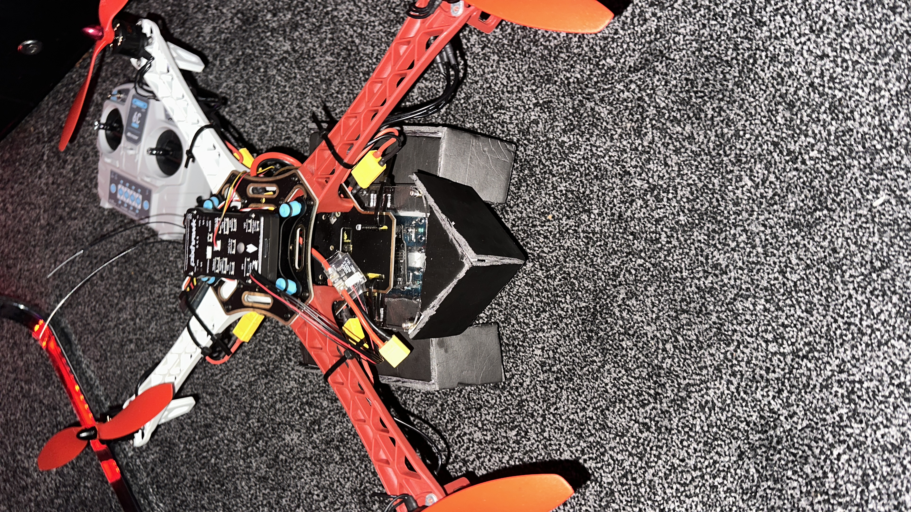
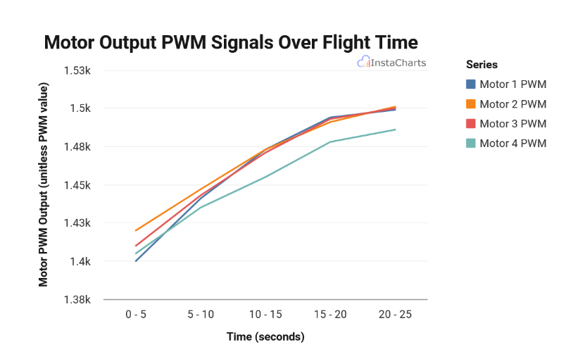

# Hybrid Ground-Air Rover with VTOL Capability

## 📌 Project Overview
This repository contains the full technical documentation and framework for a hybrid robotic system designed for Search and Rescue (SAR) operations. The rover overcomes the limitations of single-mode platforms by combining the endurance of a tracked UGV with the vertical access of a quadcopter UAV.

### 🤖 Core Robotics & Engineering Highlights
* **Multi-Modal Control:** Integrated a dual-controller architecture using an **Arduino Elegoo R3** for ground differential drive and a **Pixhawk PX4** for aerial stability and VTOL flight.
* **Mechanical Integration:** Custom-engineered a 1.75kg hybrid chassis that maintains a **1.9:1 thrust-to-weight ratio**, ensuring stable flight even with the added mass of a ground propulsion system.
* **Sensor Fusion & Telemetry:** Implemented real-time data logging of GPS, IMU, and barometric data using the MAVLink protocol and Mission Planner for flight analysis.
* **Power Management:** Designed a redundant power system utilizing 3S LiPo batteries for flight and dedicated Li-ion packs for ground operation.

## 📊 Technical Data Analysis

* **Signal Validation:** Conducted rigorous PWM waveform analysis (see Figure 3.6 in the report) to verify the ESC duty cycles during flight transitions.
* **Stability Testing:** Used MAVLink telemetry to confirm the Pixhawk PID loop's ability to maintain a stable hover despite the ground-locomotion offset weight.

## 🛠 Tech Stack
* **Microcontrollers:** Pixhawk PX4 (Flight), Arduino Elegoo R3 (Ground).
* **Propulsion:** 935KV Brushless Motors, 20A BLHeli ESCs, Dual DC Motors.
* **Software:** PX4 Autopilot, Mission Planner, Arduino IDE, BLHeli Configurator.
* **Communication:** Microzone 6C Mini 2.4 GHz 6-Channel.

## 📁 Repository Structure
* `/Docs`: `Postgrad_Dissertation_Hybrid_Rover.pdf` - Full 60+ page technical report.
* `/Firmware`: Custom Arduino ground control scripts and Pixhawk configuration logs.
* `README.md`: Project summary and technical specifications.

---
*Note: This project was completed as a postgraduate technical study in Robotics.*
